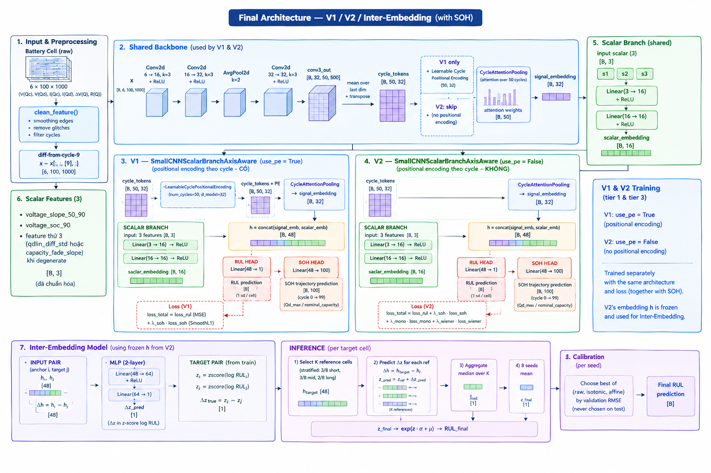

# Architecture — V1 / V2 / Inter-Embedding (with SOH)

Diagram drawn by the user from `src/battery_pinn`'s code (backbone, losses,
inter-embedding) — kept here as the canonical reference for the full
pipeline. If the code and this diagram ever disagree, the code is the
source of truth; update this diagram to match, not the other way around.

## Where each block lives in code

| Diagram block | Source |
|---|---|
| 1. Input & Preprocessing, `clean_feature()` | `src/battery_pinn/features/cleaning.py` |
| 2. Shared Backbone (Conv2d x3 + AvgPool2d, cycle_tokens) | `src/battery_pinn/models/backbone.py` — `SmallCNNScalarBranchAxisAwareTier3.__init__`/`forward` |
| 3–4. V1 (`use_pe=True`) / V2 (`use_pe=False`), RUL + SOH heads | same class — `LearnableCyclePositionalEncoding`, `CycleAttentionPooling` |
| 5. Scalar Branch (shared) | `self.scalar` in `backbone.py` (`Linear(3→16)→ReLU→Linear(16→16)→ReLU`) |
| 6. Scalar Features (3) | `TOP3_FEATURES` in each dataset's `ensemble/run_*.py` (`qdlin_diff_std`, `voltage_slope_50_90`, `voltage_soc_90`, with a per-dataset fallback swap when a feature degenerates — see `scripts/*/ensemble/run_*_smallcnn_screen.py` docstrings) |
| Loss (V1)/(V2) | `src/battery_pinn/losses/tier3.py` — `tier1_total_loss` (no mono/wiener) / `tier3_total_loss` (adds `monotonicity_loss` + `wiener_loss`) |
| 7. Inter-Embedding Model, inference (K-reference, median, 8-seed mean) | `src/battery_pinn/models/inter_embedding.py` — `InterEmbeddingModel`, `build_reference_set`, `run_inter_embedding` |
| Calibration | `src/battery_pinn/calibration/ensemble.py` — see caveat below |

## One correction vs. the diagram

The diagram's bottom-right "Calibration" box ("Choose best of {raw,
isotonic, affine} by validation RMSE") describes an **earlier** exploration
step, not what the current, verified pipeline does. The actual
`calibration/ensemble.py` only implements **affine** calibration (fit
`y = a*x + b` on val) followed by either NNLS-weighted or simple-mean
combination — isotonic and "raw, no calibration" were tried at various
points this session (e.g. CRUSH's V1-solo-raw vs. affine-calibrated
ablation, `reports/day_0906/report.md` Error Analysis §2) but are not a
per-run automatic "pick the best of three" switch anywhere in the current
code. If you want that three-way switch, it does not exist yet — it would
need to be added to `calibration/ensemble.py`'s `ENSEMBLE_METHODS` registry.

## Known caveat baked into this diagram

**NNLS is not a safe default for the final ensemble step** (bottom-right
"Final RUL prediction"). On CRUSH's redesigned val=20 cache (8-seed),
simple mean beat NNLS on both mean RMSE (339.8 vs. 341.0) and stability
(std 13.9 vs. 21.8) — see `README.md`'s Results table and
`reports/day_0906/report.md`'s CRUSH section. Always compute and report
both (`affine_nnls_ensemble` and `simple_mean_ensemble` in
`calibration/ensemble.py`), not just NNLS.
