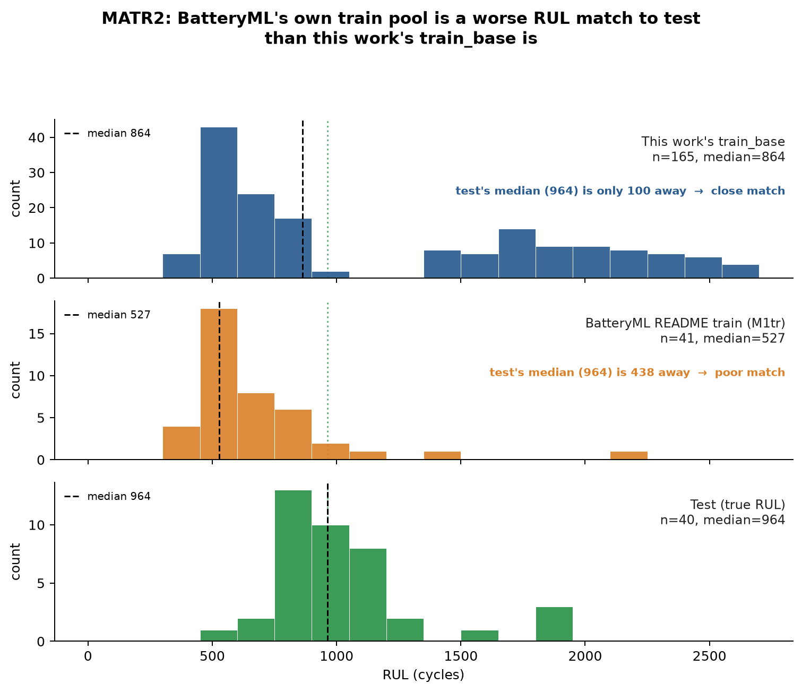
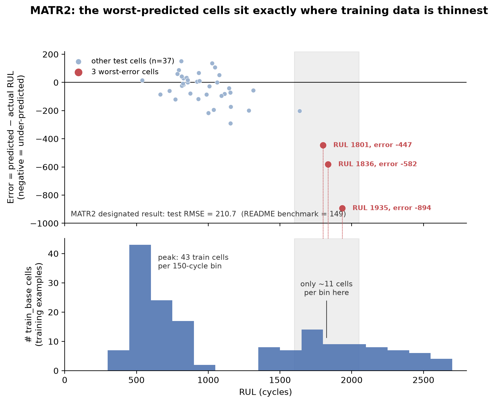
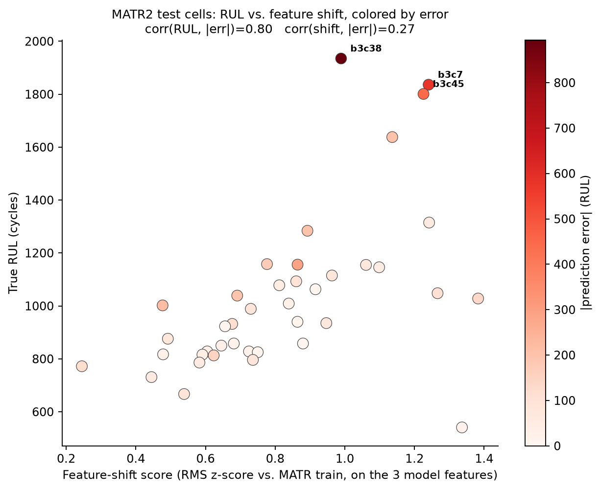

# Physics-Informed Wiener-Diffusion Modeling with Cycle-Axis Attention for Lithium-Ion Battery Remaining Useful Life Prediction

> **Draft status**: outline + key sections drafted for review. HUST and CRUSH Tier-3 runs are both complete at 8/8 seeds (§5.1, §5.3, §5.4, §6.3) — HUST's proposed result is Tier-1 (8-seed); CRUSH's proposed result is Tier-3 on a redesigned val/train split (8-seed), which now beats local reproduction for the first time (still short of README). MATR1's headline is the 8-seed result (73.0±6.7, `NNLS[all 6]`, §5.1), complete across all seeds — note its per-seed component weights are unstable (§7), unlike HUST/CRUSH's validation-robust tier choices. SNL, CRUH, and MATR2 single-seed screens (§5.5–§5.7) are filled in with real numbers and an explicit validation-instability demonstration; CALCE standalone remains `[TBD]` (not yet screened). Optimizer/lr/patience for these single-seed screens are still `[TBD]` (Appendix B) — do not cite protocol details for them before backfilled and verified against `reports/`.

## Abstract

Accurate battery remaining useful life (RUL) prediction remains challenging because RUL labels are sparse, degradation trajectories vary substantially across cells, and models often generalize poorly across laboratories and testing protocols. We propose a degradation-aware architecture combining a CNN backbone, learned attention pooling over the cycle axis, and physics-derived voltage–capacity features, trained with plain MSE and no auxiliary loss. We further investigate a physics-informed auxiliary objective (Tier-3) that supervises the predicted state-of-health trajectory using a monotonicity constraint and a Wiener-process diffusion term ($dD(t) = \mu\,dt + \sigma\,dW(t)$) over the capacity-fade increment, together with an Inter-Cell Embedding module that corrects predictions using pairwise relationships between cells. Under an 8-seed evaluation protocol with validation-based model selection, we evaluate the resulting pipeline on MATR1, HUST, and CRUSH against both the published benchmark and our own local reproduction of it: the pipeline surpasses the benchmark on MATR1 (73.0 vs. 90 RMSE) and HUST (289.8 vs. 322 RMSE), and improves over local reproduction on CRUSH (339.8 vs. 355 RMSE) while remaining below the published benchmark (330) on that dataset. The benefit of the physics-informed objective is dataset-dependent rather than uniformly positive. We disclose the one deviation from the pre-declared protocol — an auxiliary loss weight screened using test-RMSE feedback rather than validation (§4.3) — and distinguish it explicitly from the validation-only selection used elsewhere. These results suggest that degradation-aware architectural design and inter-cell relational information can meaningfully improve cross-dataset RUL prediction, supporting applications such as warranty risk assessment and second-life battery triage, while the effectiveness of physics-informed supervision depends on dataset characteristics that must be checked rather than assumed.

---

## 1. Introduction

### 1.1 Background & Motivation

Lithium-ion batteries are widely used in electric vehicles, renewable energy integration, and portable electronics. Accurate estimation of their remaining useful life (RUL) is critical for safe operation, maintenance planning, and cost reduction. Battery degradation is influenced by chemistry, operating conditions, and manufacturing variability, leading to heterogeneous degradation trajectories across cells and datasets.

From a machine learning perspective, RUL prediction poses several challenges:

- The RUL label is a single scalar per cell, observed only at end-of-life.
- The degradation process is rich in information (voltage, capacity over cycles), but most models only optimize for the final RUL value.
- Datasets collected by different laboratories exhibit domain shift in protocols, chemistry, and measurement noise, causing models trained on one source to degrade on another.

### 1.2 Problem & Gap

Existing deep learning approaches for battery RUL prediction often:

- Optimize only an RUL loss, ignoring the dense degradation signal available in the SOH trajectory.
- Use random or under-documented train/validation/test splits, which risks implicit test-data leakage into model or hyperparameter selection.
- Report results on a single split or seed, without analyzing generalization across sources or laboratories.
- When they do add an SOH-based auxiliary loss, it is often labeled "physics-informed" without an explicit governing equation — an auxiliary-supervision claim, not a physics-constraint claim. A smaller number of recent works (2024–2026) do embed an explicit governing equation, including Wiener-process SDEs for battery capacity fade (§2.2); what is largely absent even there is an ablation isolating the *marginal* value of the governing-equation constraint over auxiliary supervision alone, and disclosure of cases where the constraint does not help.

These gaps motivate a controlled investigation of whether explicit degradation modeling provides benefits beyond auxiliary SOH supervision, and whether inter-cell relationships can improve cross-dataset RUL prediction.

### 1.3 Proposed Approach

We propose a battery RUL prediction framework with four methodological components and one evaluation component. This subsection summarizes their roles; §1.4 states the corresponding contributions and evidence.

**Method**

1. **Axis-aware attention backbone:** a lightweight CNN extracts cycle-level representations, followed by learned attention pooling over the cycle axis in place of fixed pooling. Two variants are considered, with or without learnable cycle positional encoding.
2. **Physics-derived scalar feature branch:** three handcrafted voltage–capacity features — capacity-fade non-uniformity across voltage bins, discharge-voltage slope in the high-SOC region, and discharge voltage at 90% SOC (§3.3) — are encoded in parallel and fused with the attention backbone's representation into a shared cell embedding. An architecture ablation finds this branch and attention pooling contribute comparably — removing either costs a similar amount relative to the full architecture (§4.2, §5.2).
3. **Tier-3 physics-informed objective:** the model jointly learns SOH and capacity-fade dynamics using auxiliary SOH supervision, a monotonicity constraint, and an explicit Wiener-process degradation model (§3.5).
4. **Inter-Cell Embedding correction:** pairwise relationships between cell embeddings are used to predict relative RUL differences, which are aggregated across reference cells to correct the target-cell prediction (§3.6).

**Evaluation**

5. **Source-aware and cross-dataset evaluation protocol:** we use source-aware splits, 8-seed evaluation, and explicitly disclosed cross-dataset donor augmentation when a dataset is too small for a reliable train/validation split — HUST's train pool includes MATR-family donors, and CRUSH's train/validation pool includes HUST/Tongji donors plus, after the redesign, 20 additional cross-dataset donors. Donors are selected based on distributional proximity rather than random sampling, while test cells remain source-specific (§4.1, §5.1, §6.3). Model selection is validation-based except for explicitly disclosed deviations (§4.3).

### 1.4 Contributions

**Method contributions**

- **An axis-aware attention backbone that improves RUL prediction before physics-informed supervision.** Combined with the scalar branch (below), it surpasses the published README benchmark on MATR1 and HUST using plain MSE, without SOH supervision or physics-informed losses (§5.1).
- **A physics-derived scalar feature branch that contributes comparably to attention pooling.** An architecture ablation (SmallCNN 130.8 → +scalar branch 95.4 → full axis-aware architecture 84.74±9.93, MATR1, 8-seed, §5.2) removes each component in turn: dropping the scalar branch (103.72±12.50) or replacing attention pooling with a plain mean (102.23±13.30) costs a similar amount, so neither dominates the architecture's overall gain.
- **An explicit physics-informed objective with a tested marginal contribution.** Tier-3 defines physics-informed supervision through an explicit stochastic degradation model rather than SOH-auxiliary supervision alone (§2.2). Its effect is evaluated separately across datasets rather than pooled: it improves CRUSH, is neutral on MATR1, and degrades HUST consistently across seeds and components (§5.2–§5.4, §6.3).
- **Inter-Cell Embedding as a relational correction mechanism.** The module uses pairwise cell relationships to provide information beyond individual-cell prediction, and is combined with the backbone through a validation-based selection over both tiers rather than a fixed pairing — robust for HUST and CRUSH, but not for MATR1, where the selected combination is seed-unstable (§3.6, §6.2, §7).

**Evaluation contribution**

- **A source-aware, multi-seed, and explicitly disclosed evaluation protocol.** Source-based splits, 8-seed evaluation, validation-based model selection, and explicit disclosure of deviations and remaining reproducibility gaps (§4.1, §4.3, §5.5–§5.7, §7, Appendix B).

---

## 2. Related Work

### 2.1 Deep Learning for Battery RUL Prediction

Recent works have applied CNNs, LSTMs, and attention mechanisms to battery RUL prediction. [Zhou et al. (2020)](https://doi.org/10.1088/1757-899X/895/1/012006) combine a CNN with attention and positional encoding on the NASA dataset; [Suh et al. (2024)](https://doi.org/10.1016/j.heliyon.2024.e36236) (ST-MAN) use a CNN-LSTM-attention architecture on the MIT and HUST datasets; [TDANet (2024)](https://ieeexplore.ieee.org/document/10268614/) proposes a temporal/differential dual-attention network on NASA and CALCE. These studies generally predict from windows identified after degradation onset — not a fixed early-cycle horizon — and do not use the SOH trajectory as auxiliary supervision. We cite them for context, not as directly comparable baselines: input horizon, label definition, and split/seed methodology all differ. This paper's actual quantitative baseline is the published [BatteryML](https://github.com/microsoft/BatteryML) benchmark suite (the "README" figures in §5.1: PCR/PLSR/GPR/Random Forest per dataset), not the architecture literature above. What remains uncharacterized, to our knowledge, is the combination this work evaluates: an early-cycle-only horizon, SOH-trajectory auxiliary supervision, an explicit physics/SDE objective, and validation-based selection under a source-aware, multi-seed protocol.

### 2.2 Physics-Informed Learning, and Why We Distinguish Two Tiers

Physics-informed neural networks (PINNs), as defined by Raissi et al. (2019), incorporate a governing differential equation directly into the training loss as a soft constraint. Much of the recent "physics-informed" battery literature — including our own earlier Tier-1 design — instead uses a physically meaningful *quantity* (e.g., SOH) as an auxiliary supervision target, without an explicit governing equation. We treat this distinction as consequential rather than terminological.

**Prior work that does use an explicit governing equation.** A small number of recent works embed an explicit Wiener-process SDE into a physics-informed loss for degradation prediction. Most closely related is [Ahmadi Mousavi et al. (2026)](https://onlinelibrary.wiley.com/doi/10.1155/er/9923180) (WINN), which learns Wiener-process drift/diffusion via a KL-divergence residual on the Oxford battery dataset. Two more distant lines of work: [a 2025 Reliability Engineering & System Safety paper](https://www.sciencedirect.com/science/article/abs/pii/S0951832025001097) couples a Wiener process with online Bayesian updates for sequential monitoring rather than static early-cycle prediction; [Selim (2026)](https://onlinelibrary.wiley.com/doi/full/10.1002/qre.70186) imposes monotonicity and a first-order decay law (no diffusion term) for grid-storage batteries. Tier-3 (§3.5) does not claim priority for the Wiener-SDE idea itself. What is new, to our knowledge, is (i) an ablation isolating its marginal value over SOH-auxiliary supervision alone (§5.2, §5.3, §5.4), and (ii) a disclosed case where it measurably hurts (HUST, §6.3) — the three works above each report a net benefit, none a per-dataset failure case.

We distinguish two tiers accordingly:

- **Tier-1 (SOH-auxiliary)**: an auxiliary head predicts the SOH trajectory, supervised with a standard regression loss. This regularizes the representation toward a physically meaningful quantity but enforces no dynamics.
- **Tier-3 (SDE-regularized)**: in addition to the SOH-auxiliary term, we add a monotonicity constraint and a Wiener-process diffusion loss over the *modeled* capacity-fade process, i.e., an explicit SDE governing how SOH evolves between cycles (§3.5). In the sense of Raissi et al. (2019), this loss enforces a governing equation structurally, rather than treating SOH as only a supervision target. We do not claim the SDE's own assumptions — independent Gaussian increments, unconstrained sign of the drift, no explicit bound on $D_t\in[0,1]$ — are separately validated against the data; §3.5 states exactly which of these are enforced by the architecture and which are not.

We select between tiers by validation performance per dataset rather than fixing either's role in advance; which tier governs the backbone or the Inter-Cell Embedding's source is therefore dataset-dependent, not assumed (§5–§7).

### 2.3 Cross-Cell, Transfer Learning, and Domain Generalization

Transfer learning and domain adaptation are increasingly explored for battery degradation prediction. [Zhang et al. (2024)](https://doi.org/10.1016/j.jpowsour.2024.235534) transfer capacity-aging trajectories across battery domains via a learned voltage-capacity mapping; [Tran et al. (2025)](https://doi.org/10.1371/journal.pone.0335066) (HybridoNet-Adapt) align source/target feature distributions (MMD) between the TRI and LHP datasets. Both formulate an *adaptation* setting where target-domain data is available during training — different from our question, whether a model trained on one lab source generalizes to an independent source *without* adaptation. We cite them for context, not as baselines. This motivates our source-aware, no-adaptation protocol: partitioning by dataset and source, validation-based selection, and cross-source error analysis (§4.1, §4.3, §5.5–§5.7). Where a dataset is too small for a reliable split, we reinforce train/validation with cross-dataset donor cells chosen by distributional proximity, keeping test cells source-specific (§4.1, §6.3).

---

## 3. Methodology

### 3.1 Problem Formulation

Let $i$ index a battery cell. For each cell, we observe an input trajectory $X_i$ (voltage and capacity over early cycles), a scalar RUL label $y_i$, and an SOH trajectory $\mathbf{s}_i = [s_{i,1}, \dots, s_{i,T}]$, $T=100$, defined as discharge capacity normalized by nominal capacity ($Q_{d,\max}/Q_{\mathrm{nominal}}$) at each cycle. Our goal is to learn $f_\theta$ such that $\hat{y}_i = f_\theta(X_i)$, optionally using $\mathbf{s}_i$ as an auxiliary/physics-informed target during training only; at inference, only $X_i$ is available, and $\mathbf{s}_i$ is never used.

### 3.2 Input Representation

Each cell is represented as a tensor $X_i \in \mathbb{R}^{6\times100\times1000}$: 6 channels ($V(Q_c)$, $V(Q_d)$, $I(Q_c)$, $I(Q_d)$, $\Delta V(Q)$, $R(Q)$) over 100 cycles, each at 1000-point resolution. A cleaning step (`clean_feature`) smooths edges, removes glitches, and filters anomalous cycles; the model then consumes the difference from a fixed reference cycle ($x - x[:,:,[9],:]$, cycle index 9) rather than raw values. We normalize across cells and cycles using training-split statistics only (Appendix B), and ensure no information from cycles beyond the input window is used at prediction time.

### 3.3 Physics-Derived Degradation Features

Three handcrafted scalar features, computed over early cycles (0–99) from observed data only (no label leakage):

1. **qdlin_diff_std** — $\mathrm{std}_V[Q_{dlin}^{(99)}(V) - Q_{dlin}^{(9)}(V)]$: non-uniformity of capacity fade across voltage bins; falls back to a capacity-fade-slope estimate when degenerate (e.g., insufficient voltage-bin coverage).
2. **voltage_slope_50_90** — $\frac{V_{90}-V_{50}}{0.4}$: discharge-voltage slope in the high-SOC region.
3. **voltage_soc_90** — $V_{90}$: discharge voltage at SOC 90%.

### 3.4 Network Architecture

We refer to the backbone as the axis-aware attention network, with two variants distinguished only by whether a positional encoding is applied over the cycle axis:

- **V2** — no positional encoding.
- **V1** — a learnable cycle positional encoding is added before attention pooling.

Figure 1 summarizes the full pipeline: shared CNN backbone → V1/V2 attention pooling → fusion with the scalar branch → RUL/SOH heads (§3.4-§3.5), plus the Inter-Cell Embedding module and its inference-time aggregation (§3.6).

#### 3.4.1 CNN Backbone

A Conv2d stack — $6\to16$ (kernel 3, padding 1) + ReLU, $16\to32$ (kernel 3, padding 1) + ReLU, AvgPool2d (kernel 2), $32\to32$ (kernel 3, padding 1) + ReLU — reduces the input to a $32\times50\times500$ feature map. Averaging over the last (within-cycle) dimension and transposing yields cycle-indexed tokens $\in \mathbb{R}^{50\times32}$ (the 100-cycle input halves to 50 cycles under AvgPool2d).

#### 3.4.2 Cycle Attention Pooling

A small MLP scores each cycle token independently (Linear $\to$ ReLU $\to$ Linear, producing one scalar per cycle); softmax over the 50 cycles turns these scores into attention weights, and the sequence embedding is their weighted sum over cycle tokens. This is a learned content-based scoring function, not a query-key dot-product attention mechanism, and it replaces fixed (e.g., average) pooling over the cycle axis.

#### 3.4.3 Scalar Feature Branch

The three physics-derived features pass through a small MLP (3→16→16, ReLU).

#### 3.4.4 Fusion, Embedding, and Regression Head

The sequence embedding and scalar embedding are concatenated into a 48-dim cell embedding $h_i$, which is (a) passed through a linear RUL head, and (b) reused as-is by the Inter-Cell Embedding module (§3.6) and the auxiliary heads (§3.5):
$$
\hat{y}_i = \mathrm{Linear}_{\mathrm{RUL}}(h_i).
$$

### 3.5 Training Objectives: Tier-1 (SOH-Auxiliary) and Tier-3 (Physics-Informed)

**RUL loss (both tiers, and the no-SOH baseline).** We use plain MSE, not Huber:
$$
\mathcal{L}_{\mathrm{RUL}} = \mathrm{MSE}(\hat{y}_i, y_i).
$$

**Tier-1 (SOH-auxiliary).** An additional head $\mathrm{soh\_head}: \mathbb{R}^{48}\to\mathbb{R}^{100}$ predicts the SOH trajectory, supervised with Smooth-L1 (Huber):
$$
\mathcal{L}_{\mathrm{SOH}} = \mathrm{SmoothL1}(\hat{\mathbf{s}}_i, \mathbf{s}_i), \qquad
\mathcal{L}_{\mathrm{Tier1}} = \mathcal{L}_{\mathrm{RUL}} + \lambda_{\mathrm{SOH}}\,\mathcal{L}_{\mathrm{SOH}}.
$$
Tier-1 is not claimed as physics-informed in the strict sense (§2.2). We initially intended it only as the embedding source for the Inter-Cell Embedding module (§3.6), but validation-based selection ended up adopting Tier-1 components directly into the proposed pipeline for two of three datasets — the entire ensemble for HUST, and several components at some seeds for MATR1's `NNLS[all 6]` (§5.1, §5.2, §7) — so it is not accurate to describe Tier-1 as never a standalone result.

**Tier-3 (physics-informed, this work's main objective).** Two additional heads, $\mu_{\mathrm{head}}$ and $\sigma_{\mathrm{head}}$ (each $\mathbb{R}^{48}\to\mathbb{R}^{100}$), parameterize a Wiener process over the modeled capacity-fade increment. Let $D_t = 1 - \hat{s}_{i,t}$:

$$
\mathcal{L}_{\mathrm{mono}} = \frac{1}{T-1}\sum_{t=1}^{T-1} \mathrm{ReLU}\big(\hat{s}_{i,t+1} - \hat{s}_{i,t} - \tau\big), \qquad \tau = 0.002,
$$
$$
\Delta D_t = D_{t+1} - D_t, \quad r_t = \Delta D_t - \mu_t, \quad v_t = \sigma_t^2 + \epsilon,
$$
$$
\mathcal{L}_{\mathrm{Wiener}} = \frac{1}{T-1}\sum_{t=1}^{T-1} (\frac{1}{2}\frac{r_t^2}{v_t} + \frac{1}{2}\log v_t),
$$
$$
\mathcal{L}_{\mathrm{Tier3}} = \mathcal{L}_{\mathrm{RUL}} + \lambda_{\mathrm{SOH}}\mathcal{L}_{\mathrm{SOH}} + \lambda_{\mathrm{mono}}\mathcal{L}_{\mathrm{mono}} + \lambda_{\mathrm{wiener}}\mathcal{L}_{\mathrm{Wiener}}.
$$

Pre-declared weights: $\lambda_{\mathrm{SOH}}=0.01$, $\lambda_{\mathrm{mono}}=0.05$, $\lambda_{\mathrm{wiener}}=0.05$, used identically across MATR1, HUST, and CRUSH in the Tier-3 backbone. (A separate, disclosed screen over $\lambda_{\mathrm{SOH}}\in\{0.01,0.05,0.1\}$ was run at the Tier-1 stage on all three datasets — see §4.3 and §7 for what was and was not used from that screen.)

$\mathcal{L}_{\mathrm{Tier3}}$ is what we regard as physics-informed in a structural sense: the Wiener term encodes an explicit governing SDE for degradation, not just a regression target. This is a claim about the loss's *form*, not a claim that the SDE's assumptions have been separately validated against the data — the next paragraph states exactly which of those assumptions are enforced by construction and which are not.

**Which SDE constraints are actually enforced.** $\sigma_t$ is guaranteed positive by construction ($\sigma_t = \mathrm{softplus}(\sigma_{\mathrm{head}}(h)) + 10^{-6}$, so $v_t>0$ and $\mathcal{L}_{\mathrm{Wiener}}$ is always well-defined). $\mu_t$ carries no sign constraint — the network is free to predict drift in either direction, so "monotonic decay in expectation" is encouraged only indirectly, through $\mathcal{L}_{\mathrm{mono}}$ acting on $\hat{s}_{i,t}$ directly, not through a constraint on $\mu_t$ itself. $D_t = 1-\hat{s}_{i,t}$ has no explicit bound to $[0,1]$ in the loss; the SOH head's output range is unconstrained (a linear layer, no sigmoid), so this bound is not architecturally guaranteed, only empirically typical. The Wiener loss also treats increments as conditionally independent Gaussians given $\mu_t,\sigma_t$ — a modeling choice consistent with a discretized Wiener process, not a property we separately verify against the observed SOH trajectories. We report these as scoped limitations of the current implementation, not as settled properties of the model.

### 3.6 Inter-Cell Embedding Module

Rather than operating on raw RUL, this module works in a normalized, log-scaled space: let $z_i = \mathrm{zscore}(\log y_i)$, with mean/std taken over the training split. For a pair of cells $(i,j)$ with frozen embeddings $h_i, h_j$ from a trained backbone, a small MLP ($48\to64\to1$, ReLU) predicts the pairwise difference in this space:
$$
\widehat{\Delta z}_{ij} = g_\phi(h_i - h_j), \qquad \Delta z_{ij} = z_i - z_j \text{ (training target)}.
$$
At inference, for a target cell $t$ and each of $K$ stratified reference train cells $r$ (drawn across short/medium/long RUL strata), we recover $\hat{z}_{t}^{(r)} = z_r + \widehat{\Delta z}_{t,r}$ and take the median over the $K$ references. This is repeated for each of 8 independently trained delta-model seeds; the final estimate is the *mean* of the 8 per-seed medians, then mapped back to RUL via $\hat{y}_t = \exp(\hat{z}_t \cdot \sigma + \mu)$ using the training split's log-RUL mean $\mu$ and std $\sigma$.

**Which embedding to use.** The embedding tier (Tier-1 or Tier-3) is not fixed in advance — it is one axis of the validation-based ensemble search (§4.2). On MATR1 (8-seed, solo), the module scores 80.9±4.8 on the Tier-3 embedding vs. 74.1±8.4 on Tier-1, but a full search over all components does not settle on either consistently across seeds (§5.2, §6.2).

**Notation.** We write a component as `<variant>-<tier>` (e.g. `V1-T3`), and `Inter(V2-T1)` for the module built on frozen V2-Tier-1 embeddings. `NNLS[all 6]` fits NNLS over all six components (V2-T3, V1-T3, Inter-T3, V2-T1, V1-T1, Inter-T1) at once, letting validation set the weights rather than fixing a tier pairing in advance. The proposed formula per dataset is stated in §5.1 — MATR1's, `NNLS[all 6]`, has unstable per-seed weights (§5.2, §7).

---

## 4. Experimental Protocol

### 4.1 Datasets

| Dataset | Train | Val | Test | Reported RMSE† | Notes |
|---:|---:|---:|---:|---:|---|
| MATR1 | 91 | 41 | 42 | 90 (PCR) | Official test split; train/val construction below |
| HUST | 63 | 12 | 22 | 322 | Includes 20 cross-dataset donor cells (Donor-cell leakage check, below) |
| CRUSH | 70 | 20 | 44 | 330 | Cross-lab composite (CALCE, RWTH, UL-PUR, SNL, HUST, Tongji); redesigned split, details below |

**Reported RMSE.** Reported RMSE values are taken from the corresponding repository/README and are provided only as reference points. They are not treated as reproduced baselines unless explicitly stated.

**MATR1 split construction.** The official MATR1 test set contains 42 cells after removing cells with undefined RUL labels and is kept untouched. Train and validation are constructed from a separate candidate pool using MATR1 train cells and eligible MATR3/4 cells. High-RUL tail cells are kept in training, while validation is selected to preserve the RUL distribution of the candidate pool. No HUST cells are used in the MATR1 split.

**CRUSH split.** The CRUSH split was redesigned to improve cross-lab coverage and reduce split-specific artifacts (§6.3). Unless otherwise stated, all main results use the redesigned 70/20/44 split.

**Naming note.** CRUSH and CRUH are distinct datasets. CRUSH is the cross-lab composite benchmark (reported RMSE: 330), whereas CRUH has a reported RMSE of 60.

**Donor-cell leakage check.** Donor cells are added only to the training set of the target dataset and never to its own validation or test set. However, some donors overlap with held-out cells of other datasets: 14/20 MATR-family donors in HUST overlap with the MATR1 test set, and 11/20 HUST donors in CRUSH overlap with HUST validation/test cells. Thus, each dataset's own test evaluation remains untouched, but cross-dataset donor exposure is present and is explicitly reported.

#### 4.1.1 Auxiliary screening datasets

CRUH, SNL, and CALCE were used only for preliminary single-seed screening (§5.5, §5.6) and are not part of the main quantitative comparison — their available cell counts do not support a reliable validation protocol. Reported RMSE for context: CRUH 60, SNL 200; CALCE has no published reference number in this benchmark suite.

### 4.2 Baselines

All configurations use the same train/validation/test splits (§4.1), preprocessing (§3.2–3.3), target definition (§3.1), and evaluation protocol (§4.3), unless explicitly stated otherwise. The baselines are grouped by their role in the experimental study.

**(1) Architecture-ladder baselines.** These provide progressively stronger architectural references below V1/V2:

- **SmallCNN**: a plain CNN with fixed pooling, without a scalar branch or axis-aware attention pooling.
- **SmallCNN + scalar branch** (`SmallCNNScalarBranch`): extends SmallCNN with the three-feature scalar branch (§3.3), while retaining fixed pooling.

**(2) Proposed backbone variants.** Both variants use the axis-aware attention architecture (§3.4):

- **No-SOH** (`SmallCNNScalarBranchAxisAware`): the proposed backbone trained with MSE only, without the auxiliary SOH head or physics-informed losses.
- **Tier-1**: No-SOH + auxiliary SOH head trained with Smooth-L1 loss.
- **Tier-3**: No-SOH + auxiliary SOH head + monotonicity constraint + Wiener-process diffusion loss (§3.5).

V1 and V2 denote the same backbone with and without cycle positional encoding, respectively. The SOH-loss weight $\lambda_{\mathrm{SOH}}$ follows the pre-declared setting described in §4.3.

**(3) Proposed ensemble.** The final ensemble combines backbone and Inter-Cell Embedding components (§3.6), with which components to include and the combination rule (NNLS or unweighted mean) selected per dataset by validation performance. The selected formula per dataset is reported explicitly in §5.1.

**(4) External reported benchmarks.** RMSE values reported in the corresponding repositories/READMEs (§4.1) are included only as reference points. They are not reproduced baselines and were not evaluated under the present experimental protocol.

### 4.3 Evaluation Protocol

- **Multi-seed evaluation.** Main results on MATR1, HUST, and CRUSH use 8 random seeds. CRUH, SNL, and MATR2 are each evaluated with a single seed for preliminary screening only (§5.5–§5.7) and are not used for main claims. CRUH/SNL's issue is primarily too few cells for a reliable validation split; MATR2's is different — ~230 cells (not small), but it is the benchmark suite's known hard case. BatteryML frames this as an unseen-charging-protocol distribution shift, but §5.7 tests that framing directly against the input features the model uses and finds it only weakly supported (r=0.27 between feature shift and error); the verified driver is instead a density gap in train_base's high-RUL region (r=0.80 between RUL and error), so its single-seed screen (210.7 vs. README 149, §5.7) reflects that gap more than either validation instability or protocol shift per se. The MATR1 No-SOH baseline is an exception and was not re-run with 8 seeds; it is therefore excluded from the 8-seed objective comparison in §5.2 rather than mixed in at an unequal seed count.
- **Checkpoint selection.** For each seed, the checkpoint with the lowest validation RMSE is selected, and the test set is evaluated once using that checkpoint.
- **Metrics.** RMSE, MAE, MAPE, and $R^2$ are used as evaluation metrics. The main results in §5.1 currently report RMSE; the remaining metrics will be added after the corresponding evaluation backfill.
- **Pre-declared Tier-3 hyperparameters.** The Tier-3 parameters $\lambda_{\mathrm{SOH}}, \lambda_{\mathrm{mono}}, \lambda_{\mathrm{wiener}}, \tau$ (§3.5) are fixed identically across datasets and are not tuned per dataset.

**Development-time deviation.** During Tier-1 development, $\lambda_{\mathrm{SOH}} \in \{0.01, 0.05, 0.10\}$ was screened using test RMSE feedback: single-seed on MATR1 and 8-seed evaluation on HUST and CRUSH. This differs from the validation-based selection protocol above. We disclose this deviation explicitly and report the selected values below.

| Dataset | Candidates | Selection signal | Selected $\lambda_{\mathrm{SOH}}$ | Used in headline pipeline |
|---|---|---|---:|---|
| MATR1 | 0.01, 0.05, 0.10 | Test RMSE, 1 seed | 0.01 | Yes — Tier-1 embedding |
| HUST | 0.01, 0.05, 0.10 | Test RMSE, 8 seeds | 0.10 | Yes — Tier-1 ensemble |
| CRUSH | 0.01, 0.05, 0.10 | Test RMSE, 8 seeds | 0.10 | Yes — Tier-1 embedding |

The Tier-1 configurations above should not be interpreted as having been selected under a strict validation-only protocol. The reported headline results that include Tier-1 components are subject to this development-time test-feedback limitation — the results remain valid as reported experimental outcomes, but their model-selection protocol is not strictly test-independent. The screen has not yet been repeated using validation-only selection; this is left as future work (§8).

---

## 5. Results

### 5.1 Main RUL Prediction Performance

**Dataset-specific proposed configurations.** The proposed method is not a single fixed formula. For each dataset, the final configuration is selected using the validation-based procedure described in §4.2, and reported explicitly below:

- **MATR1:** `NNLS[all 6]`, using all six available components with validation-selected NNLS weights.
- **HUST:** `NNLS[V1-T1, V2-T1, Inter(V2-T1)]`, the Tier-1 ensemble.
- **CRUSH:** `mean[V1-T3, V2-T3, Inter(V2-T3)]`, the Tier-3 backbone with a Tier-3 Inter-Cell Embedding.

| Dataset | Reported RMSE | Local reproduction | Tier-1 | Tier-3 backbone | **Proposed** | Selected configuration |
|---:|---:|---:|---:|---:|---:|---|
| MATR1 | 90 | 90 | 72.3 ± 7.6 | 75.9 ± 5.1 | **73.0 ± 6.7** | `NNLS[all 6]` |
| HUST | 322 | 322 | **289.8 ± 12.4** | 316.9 ± 16.8 | **289.8 ± 12.4** | `NNLS[V1-T1, V2-T1, Inter(V2-T1)]` |
| CRUSH | 330 | 355 | 349.0 ± 22.5 | 339.9 ± 20.9 | **339.8 ± 13.9** | `mean[V1-T3, V2-T3, Inter(V2-T3)]` |

All results use 8 seeds. CRUSH uses the redesigned split (§6.3); the original split is not included in this table.

The results show clear dataset dependence in the preferred training objective: Tier-1 performs best on HUST, the Tier-3-based configuration performs best on CRUSH, and MATR1's best result comes from the broader NNLS search across both tiers. Component-level comparisons and the corresponding selection analysis are given in §5.2–§5.4 and §6.2–§6.3.

**MATR1.** The proposed configuration (`NNLS[all 6]`) is the best validation-selected configuration among the evaluated candidates, achieving 73.0±6.7 RMSE. Its per-seed NNLS weights vary substantially across seeds, so the result should not be read as evidence for one consistently dominant component (§5.2, §7).

**HUST.** The Tier-1 ensemble achieves 289.8±12.4 RMSE and outperforms the Tier-3 backbone. Tier-3 underperforms Tier-1 for the ensemble and V1 solo at every one of the eight seeds, and for the remaining components at most seeds (§5.3).

**CRUSH.** On the redesigned split, the Tier-3-based proposed configuration achieves 339.8±13.9 RMSE, improving over the local reproduction of 355 RMSE, though it remains short of the reported benchmark of 330. The split redesign and its effect on validation/test alignment are analyzed in §6.3.

### 5.2 Ablation Study (MATR1)

We organize the ablation study around three questions: **(i)** where the architectural gain comes from, **(ii)** whether the SOH-auxiliary and physics-informed objectives improve performance, and **(iii)** whether cross-cell information and unrestricted ensembling provide additional benefit. Full per-seed results are reported in Appendix A. For reference, MATR1's Reported RMSE benchmark is 90 (§4.1); every configuration below is evaluated under this paper's own protocol, not the README's.

**A. Architecture ablation** (MATR1, plain-MSE only — no SOH/tier objective; 8-seed for every row):

| Model | RMSE |
|---|---:|
| SmallCNN | 130.8 |
| SmallCNN + scalar branch | 95.4 |
| AxisAware, no scalar branch | 103.72 ± 12.50 |
| AxisAware + scalar, mean pooling | 102.23 ± 13.30 |
| AxisAware + scalar + attention (V2) | 84.74 ± 9.93 |
| AxisAware + scalar + attention + PE (V1) | 92.22 ± 8.75 |

Removing either the scalar branch or attention pooling costs a similar amount relative to V2 (~19 and ~17.5 RMSE points), so neither component alone accounts for most of the architecture's gain — both contribute comparably. As a secondary check, we also ran the no-scalar-branch ablation with positional encoding enabled (matching V1 instead of V2): $130.59 \pm 20.37$, both worse and more variable than the no-PE version above — PE appears to interact unfavorably with the missing scalar branch. This PE variant is a supplementary check, not a separate row in the table above.

**B. Tier/objective ablation, by component** (MATR1, 8-seed):

| Component | Tier-1 | Tier-3 |
|---|---:|---:|
| V2 (solo) | 84.6 ± 7.1 | 85.0 ± 6.7 |
| V1 (solo) | 91.1 ± 7.1 | 86.1 ± 9.5 |
| Inter (solo, embedding built on this tier) | 74.1 ± 8.4 | 80.9 ± 4.8 |
| NNLS[V2, V1, Inter] (ensemble) | 72.3 ± 7.6 | 75.9 ± 5.1 |

Tier-1 and Tier-3 show no consistent advantage across components: Tier-1 performs better for V2, Inter, and the ensemble, whereas Tier-3 performs better for V1. Unlike HUST (§5.3), neither objective consistently dominates on MATR1. A plain-MSE (no-SOH) backbone was screened earlier at 5 seeds but not re-run at 8, so it is not included in this comparison (§4.3).

**C. Beyond one tier: unrestricted search over both** (MATR1, 8-seed):

| Configuration | RMSE |
|---|---:|
| NNLS[V2, V1, Inter] — Tier-1 (from table B) | 72.3 ± 7.6 |
| NNLS[V2, V1, Inter] — Tier-3 (from table B) | 75.9 ± 5.1 |
| **NNLS[all 6]** (both tiers' V2/V1/Inter at once, proposed) | **73.0 ± 6.7** |

`NNLS[all 6]` fits NNLS over all six raw components (V2-T3, V1-T3, Inter-T3, V2-T1, V1-T1, Inter-T1) jointly, with weights selected on validation (§3.6). It is the **best validation-selected configuration among the 177 evaluated combinations** — and, among those, it also attains the lowest mean test RMSE. However, the selected weights vary substantially across seeds, with different components or tiers dominating different runs (per-seed detail and the specific seed-level breakdown are in §7). The result should be read as the best validation-selected outcome from an unrestricted component search, not evidence that one specific cross-tier architecture consistently dominates (§6.2, §7). Seed 4's V1-T3 outlier (100.8, Appendix A) is the poor-local-minimum case discussed in §6.1.

**Main observations:**

- **Architecture:** SmallCNN → SmallCNN + scalar branch produces a substantial improvement (130.8 → 95.4); the individual contributions of the scalar branch and axis-aware attention remain to be isolated (table A).
- **Tier/objective:** neither Tier-1 nor Tier-3 consistently dominates on MATR1.
- **Ensembling:** both fixed-tier ensembles outperform their corresponding solo components, and the unrestricted six-component search reaches 73.0 ± 6.7.
- **Positional encoding:** V1 does not consistently outperform V2 — under Tier-3, V2 is slightly better (85.0 vs. 86.1), a difference small relative to seed variability.

### 5.3 Ablation Study (HUST)

Same three questions as MATR1 (§5.2): architecture, objective, and cross-tier combination. Reported RMSE benchmark: 322 (§4.1).

**A. Architecture ablation** (plain-MSE, 8-seed):

| Model | RMSE |
|---|---:|
| SmallCNN | 316.81 ± 16.21 |
| SmallCNN + scalar branch | 334.60 ± 28.54 |
| AxisAware, no scalar branch | 339.54 ± 42.60 |
| AxisAware + scalar, mean pooling | 337.48 ± 28.20 |
| AxisAware + scalar + attention (V2) | 299.35 ± 19.33 |
| AxisAware + scalar + attention + PE (V1) | 288.91 ± 12.42 |

Unlike MATR1, where adding the scalar branch to plain SmallCNN produces a large improvement (130.8→95.4), on HUST it makes things *worse* (316.81→334.60) — and the two AxisAware ablation controls (no-scalar, mean-pool) are both worse than even the plain SmallCNN baseline, not just worse than V2. Only the full architecture (V2/V1, with both scalar branch and attention pooling together) beats plain SmallCNN; the intermediate, partially-ablated configurations do not. Removing the scalar branch or attention pooling from V2 costs a comparable amount relative to V2 itself. Unlike MATR1, PE (V1) here is the best configuration, not the worst, and the no-scalar row is far noisier (±42.6). Secondary check: no-scalar+PE scores $322.77 \pm 29.72$ — better than no-scalar alone, again opposite MATR1's direction. The PE × missing-scalar interaction is dataset-dependent.

**B. Tier/objective ablation, by component** (8-seed; per-seed detail in Appendix A). Unlike MATR1, Tier-3 is worse than Tier-1 for the ensemble and V1 solo at **every seed (8/8)**, and for V2 solo and Inter-Cell Embedding solo at **most seeds (7/8 and 6/8)** — not just an ensemble-selection artifact, but not perfectly uniform across every component either:

| Component | Tier-1 | Tier-3 |
|---|---:|---:|
| V2 (solo) | 299.5 ± 17.7 | 329.5 ± 10.6 |
| V1 (solo) | 288.0 ± 16.7 | 317.0 ± 18.0 |
| Inter (solo, embedding built on this tier) | 320.5 ± 19.7 | 334.1 ± 17.3 |
| NNLS[V2, V1, Inter] (ensemble) | 289.8 ± 12.4 | 316.9 ± 16.8 |

**C. Does a cross-tier ensemble close the gap?** A MATR1-style cross-tier ensemble (Tier-3 backbone + Tier-1-embedding Inter-Cell) recovers part of the gap (309.0±17.9, n=8) but stays below the pure Tier-1 ensemble; NNLS never assigns the Tier-3-embedding component nonzero weight. Consistent across all 8 seeds. Unlike MATR1 (§5.2C), where an unrestricted search finds a genuinely better configuration, mixing tiers here never beats single-tier Tier-1 — the Tier-3 representation itself is degraded, not just the ensemble step (§6.3).

**Main observations:**

- **Architecture:** scalar branch and attention pooling cost comparable amounts (~40, ~38 points) relative to V2, as on MATR1 — but unlike MATR1, adding the scalar branch to plain SmallCNN *hurts* here (316.81→334.60), and both partially-ablated AxisAware variants underperform plain SmallCNN; only the full V2/V1 architecture beats it.
- **Tier/objective:** Tier-3 underperforms Tier-1 on HUST for the ensemble and V1 solo at every seed, and for the other components at most seeds — unlike MATR1.
- **Ensembling:** Tier-1 ensemble (289.8±12.4) is best; cross-tier mixing helps but doesn't surpass it.
- **Positional encoding:** V1 beats V2 on HUST (288.91±12.42 vs. 299.35±19.33) — opposite of MATR1; the PE effect is dataset-dependent.

### 5.4 Ablation Study (CRUSH)

Same three questions as MATR1 (§5.2) and HUST (§5.3): architecture, objective, and which ensemble-combination method to use. Local reproduction baseline: 355 (§5.1); README Reported RMSE is 330 for reference (§4.1).

**A. Architecture ablation** (plain-MSE, 8-seed):

| Model | RMSE |
|---|---:|
| SmallCNN | 372.82 ± 11.90 |
| SmallCNN + scalar branch | 358.81 ± 23.10 |
| AxisAware, no scalar branch | 341.73 ± 26.72 |
| AxisAware + scalar, mean pooling | 358.97 ± 21.86 |
| AxisAware + scalar + attention (V2) | 354.55 ± 9.50 |
| AxisAware + scalar + attention + PE (V1) | 352.49 ± 10.03 |

Unlike HUST, adding the scalar branch to plain SmallCNN helps on CRUSH (372.82→358.81), the same direction as MATR1, and plain SmallCNN is the worst configuration in the table (unlike HUST, where it beat two of the AxisAware ablations). Within the AxisAware ladder, unlike MATR1 and HUST, where removing the scalar branch costs a clear, comparable-sized amount, `no_scalar` has the *lowest* mean RMSE of the four AxisAware rows — but also by far the highest variance (±26.72, roughly 2-3× the others), and its range overlaps substantially with V2/V1's. We read this as "no clear cost from removing the scalar branch within AxisAware, and possibly a fragile advantage," not as the scalar branch being harmful — a third distinct pattern for this component, following MATR1 (comparable cost) and HUST (comparable cost, higher-variance). Mean-pooling (replacing attention with a plain mean) costs the most among the AxisAware rows, the same qualitative direction as MATR1 and HUST.

**B. Tier/objective ablation, by component** (CRUSH, 8-seed, redesigned split; per-seed detail in Appendix A):

| Component | Tier-1 | Tier-3 |
|---|---:|---:|
| V2 (solo) | 348.1 ± 9.8 | 344.6 ± 19.8 |
| V1 (solo) | 338.4 ± 15.1 | 342.9 ± 20.0 |
| Inter (solo, embedding built on this tier) | 355.4 ± 18.1 | 350.1 ± 26.2 |
| NNLS[V2, V1, Inter] (ensemble) | 349.0 ± 22.5 | 341.0 ± 21.8 |
| **mean[V2, V1, Inter] (ensemble, proposed)** | — | **339.8 ± 13.9** |

Unlike HUST, where Tier-1 dominates everywhere, CRUSH shows the opposite ordering: Tier-3 beats Tier-1 on every component in this table, though narrowly and noisily (seed 2 is worst for both tiers, and Tier-1's NNLS there, 395.0, is worse than any of its own solo components; Appendix A).

**C. Which ensemble-combination method?** Under Tier-3, the three solo components sit within a few points of each other and of both ensemble methods, but NNLS's per-seed weights swing widely (e.g. `[0,0.48,0.52]` at one seed, `[1,0,0]` at another) — overfitting that seed's small validation set. The equal-weight mean has both a lower mean and a lower std than NNLS (339.8±13.9 vs. 341.0±21.8) and is CRUSH's proposed combination rule — though per-seed, mean has the lower raw RMSE at only 3 of 8 seeds; the aggregate advantage is a variance-reduction effect, not per-seed dominance (§6.3). Tier-1's NNLS shows the same collapse-to-one-component symptom (§5.1), so this is a property of NNLS at this validation size, not specific to Tier-3.

**Main observations:**

- **Architecture:** SmallCNN+scalar beats plain SmallCNN, the same direction as MATR1 (unlike HUST); within AxisAware, removing the scalar branch shows no clear cost (lowest mean, but highest variance) — a third distinct pattern; mean-pooling costs the most among the AxisAware rows, same direction as MATR1 and HUST.
- **Tier/objective:** unlike HUST, Tier-3 beats Tier-1 on CRUSH (339.8±13.9 vs. 349.0±22.5).
- **Ensemble method:** equal-weight mean beats NNLS — lower mean and much lower variance — because NNLS overfits per-seed on this small validation set.

### 5.5 SNL and CALCE: Single-Seed Screens

Both SNL and CALCE contain too few cells to construct a reliable held-out validation split under the same protocol used for MATR1/HUST/CRUSH (§4.1). We designate **cluster n=2** as the primary result (val n=8, val RMSE 687.04; test n=15, test RMSE 456.84; val↔test correlation **0.957**), which achieves the highest val↔test correlation among all constructions evaluated. This result does not surpass the README benchmark (200). Following the same convention adopted for CRUH (§5.6) and MATR2 (§5.7), we report the construction whose validation error most reliably tracks test error, as this is the only configuration in which validation-based model selection is methodologically defensible; the remaining constructions are presented solely to illustrate instability, not as competing candidate results.

To demonstrate this instability empirically, SNL was screened under four additional validation constructions (three from prior sessions, one re-analysis in the current session). The same architecture and training protocol yield substantially different outcomes depending only on which cells are assigned to validation, with no re-training of the underlying model:

| Val construction | # Val / Test | Val RMSE | Test RMSE | Val↔test corr |
|---|---:|---:|---:|---:|
| **Cluster n=2 (designated result)** | **8 / 15** | **687.04** | **456.84** | **0.957** |
| All-train pool (unaugmented) | 16 / 15 | 8.29 | **1816.01** | **−0.760** |
| Cluster n=1 | 4 / 15 | 388.23 | 405.46 | 0.419 |
| Random split (V2) | 5 / 15 | 468.40 | 370.57 | −0.024 |
| 4-fold CV, fold 0-3 | 4 each / 15 | 452–641 | 307.81 / 417.88 / 388.58 / **665.17** | — |

None of these configurations surpass the README benchmark (200); test RMSE varies by nearly 6× (307.81 to 1816.01) across constructions derived from the same training pool and model. In 4-fold CV alone (4 val cells per fold, 15 test cells shared across folds), test RMSE ranges from 307.81 to 665.17 while val RMSE ranges from 452 to 641 — instability within a single construction method, not only across methods. The "all-train" construction exemplifies the failure mode directly: validation RMSE is deceptively low (8.29) because the 16 validation cells are drawn from the same pool on which the model trained, whereas test RMSE is catastrophic (1816.01) and the val↔test correlation is strongly negative (−0.760) — in this regime, a lower validation error would have actively misled model selection toward a worse test outcome. This behavior is observed consistently across five independent constructions.

At the cell level, the "all-train" failure is attributable to a single outlier rather than a systemic breakdown. Among the 15 test cells, one (`SNL_18650_NCA_25C_20-80_0.5-0.5C_c`, true RUL 504) is predicted at 7315.6 — a >14× overprediction — while the remaining 14 cells have a much more modest 468.31 RMSE among themselves; excluding this single cell reduces the reported test RMSE from 1816.01 to 468.31, a 74% reduction attributable to one data point. The remaining, more moderate configurations (cluster n=1/n=2, random split, k-fold) reveal a second, milder pattern instead: the six higher-RUL LFP-chemistry cells (true RUL 323–1506) exhibit both larger errors and substantially higher prediction variance across configurations (k-fold std 140–204) than the nine lower-RUL NCA cells (true RUL 111–625, k-fold std 45–160), suggesting that the sparse high-RUL/LFP region of this dataset is where small sample size exerts the strongest adverse effect — consistent with, but more specific than, the aggregate instability described above.

**CALCE.** CALCE has not been screened as a standalone dataset — only as a donor-augmentation source for CRUH (§5.6) — so no standalone result is reported here; a dedicated single-seed screen is left to future work.

**Cross-dataset donor augmentation.** We evaluated whether adding cross-dataset donor cells to the training pool mitigates the limitations described above — this is the second time this exact intervention has been tried in this project. The cluster n=2 configuration (val↔test correlation 0.957) was reinforced with 16 donor cells selected according to the same procedure as CRUH's donor search (§5.6): the 16 nearest neighbors to SNL's train_base+val centroid in combined feature+RUL z-space, drawn from MATR2/HUST/CRUSH/Tongji (all 16 neighbors were MATR1-family cells reached via MATR2's pool). The training pool grew from 8 to 24 cells; val and test were left unchanged. This augmentation yielded test RMSE **469.01** (vs. 456.84 unaugmented — no improvement) and reduced the val↔test correlation from 0.957 to **0.30**.

This outcome mirrors CRUH's own donor-augmentation attempt (§5.6: `cluster_n3_calcedonors`, test RMSE 109.82 vs. 98.02 unaugmented; correlation 0.98→0.36): in both cases, adding feature-similar cross-dataset cells did not transfer useful training signal and degraded the reliability of the validation set. Two cases are not proof that this intervention never helps, but they are sufficient to justify not treating cross-dataset donor augmentation as a default remedy for small-N datasets in this project; the underlying limitation looks more like a genuine data-scarcity ceiling than something feature-similarity-based augmentation can overcome.

**Practical implication.** SNL should not be treated as a primary benchmark for validation-based model selection in this project. Any result reported on SNL should be accompanied by the same sensitivity analysis presented here — RMSE across multiple validation constructions, with the single-cell outlier's contribution disclosed separately — rather than a single number presented as though it were as stable as the 8-seed results on MATR1/HUST/CRUSH.

### 5.6 CRUH: Single-Seed Result and Cross-Source Error Breakdown

CRUH has the same small-N issue as §5.5 (too few cells for a reliable validation split), **plus** a second, distinct problem: it is a composite of 4 heterogeneous sources (CALCE/RWTH/UL-PUR/HNEI) at very unequal cell counts, so a single overall number can mask a highly uneven per-source error split.

**Designated result.** Cluster n=3 (base), 100.72 RMSE (`v1v2inter` ensemble, val n=17, test n=34, val↔test corr **0.980** — the highest of any construction tried, same selection convention as SNL above and MATR2 below; component solos: V2 93.47, V1 98.02, Inter 91.73) — does not beat README (60). As with SNL, we do not just assert the validation set is unreliable; several alternative validation constructions were tried across sessions (different donor-cluster compositions, holding the model/protocol fixed), and the outcome is sensitive to which cells land in val, though less dramatically than SNL:

| Val construction | Val RMSE | Test RMSE | Val↔test corr |
|---|---:|---:|---:|
| **Cluster n=3, base (designated result)** | **82.74** | **98.02** | **0.980** |
| + CALCE donors | 92.33 | 109.82 | 0.364 |
| Donor swap 0 | 74.75 | 87.54 | 0.932 |
| Donor swap 4 | 105.45 | 102.42 | 0.190 |
| Donor swap 5 | 104.50 | 100.95 | 0.468 |
| Cluster n=4 | 101.50 | 92.21 | **−0.155** |
| Cluster n=5 | 102.46 | 117.20 | **−0.687** |

Test RMSE ranges from 84 to 117 (a ~40% relative swing) across constructions of the *same* train pool and model, and val↔test correlation swings from near-perfect (0.98) to strongly negative (−0.687) — at cluster sizes n=4/5, a better validation score would again have pointed toward a *worse* test outcome, the same qualitative failure as SNL's worst case, just less extreme in magnitude.

**Per-source breakdown.** ([Corrected from an earlier draft, which mislabeled this table as "HUST-CRUSH"] — confirmed on CRUH, not CRUSH.)

| Source | # Cells | RMSE | Bias |
|---:|---:|---:|---:|
| CALCE | 4 | 242.25 | −215.08 |
| RWTH | 24 | 48.57 | −9.45 |
| UL-PUR | 1 | 53.30 | 53.03 |
| HNEI | 5 | 23.94 | 9.08 |

CALCE cells dominate the aggregate error despite being a small minority of the test set — 4 of 34 cells account for most of the error mass, and their bias is large and negative (systematic under-prediction) while the other three sources are roughly unbiased. This is the clearest evidence in this manuscript that a single pooled RMSE on a composite dataset can hide a source-specific failure mode.

**Cell-by-cell, the CALCE failure is a training-range extrapolation gap, not general noise.** All four CALCE test cells, ranked by absolute error:

| Cell | True RUL | Predicted | Error | Above CALCE train range [449, 580]? |
|---|---:|---:|---:|:---:|
| `CALCE_CX2_16` | 829 | 472.5 | −356.5 | yes |
| `CALCE_CX2_35` | 740 | 477.3 | −262.7 | yes |
| `CALCE_CS2_38` | 569 | 375.5 | −193.5 | yes |
| `CALCE_CX2_38` | 591 | 532.7 | −58.3 | just above |

The three largest errors in the entire test set are the three top rows — all severely under-predicted and all above CALCE's own training range (§5.6 val-search history). The fourth cell, only just above that range, errs by a much smaller −58.3, comparable to RWTH/HNEI cells. The model fails specifically on CALCE cells extrapolating beyond CALCE's own training RUL range, not on CALCE broadly. [TBD: an equivalent per-source breakdown for CRUSH itself — a different pipeline (§5.4) from the composite one evaluated here — has not been computed.]

**Practical implication:** report per-source (or CALCE-vs-non-CALCE) RMSE alongside any pooled number for a composite dataset, and flag predictions outside a source's own training RUL range as extrapolation rather than ordinary error.

### 5.7 MATR2: Density Scarcity, Not Just Unseen Protocol

Unlike SNL/CRUH (§5.5–§5.6), where small N causes validation instability, MATR2's dominant issue is systematic under-prediction on long-RUL cells. BatteryML frames MATR2 as testing generalization to an unseen charging protocol; we test that framing directly against an alternative explanation — a label-density gap in train_base's RUL distribution — rather than assuming it.

**Correction.** Contrary to an earlier draft, which stated MATR2 "was not evaluated at all," a single-seed no-SOH ensemble screen exists: train_base=165 (MATR1_train=33, MATR1_test=34, MATR34-b4=31, HUST=67), val=40 (8+8+14+10 from the same four sources, via a disclosed test-informed nearest-neighbor-RUL construction, same category as the λ_SOH disclosure in §4.3), test=40 (pure MATR34-b3, the official unseen-protocol batch, identical to README's own test). Because val is constructed with knowledge of test's RUL distribution, its val↔test correlation should be read cautiously. README's own train (M1tr, 41 cells) is also a worse RUL match to test than train_base: test's median (964) sits only 100 cycles from train_base's median (864) but 438 from M1tr's (527) — Figure 2.

**Result.** The `v1v2inter` ensemble achieves RMSE **210.7** (V2 247.16, V1 242.14, Inter 244.93) vs. README's 149 (~41% higher) — selected as the pool with the highest val↔test corr (0.926) of three screened (vs. 0.754, 0.266). No Tier-1/Tier-3 build exists for MATR2; this is plain-MSE only. Test RMSE stays narrow (239–247) across the three pools despite val↔test corr swinging 0.27–0.93: magnitude, not instability, is the dominant issue here.

**Cell-level diagnosis.** The three worst errors: `MATR34_MATR_b3c38` (RUL 1935, err −894), `b3c7` (RUL 1836, err −582), `b3c45` (RUL 1801, err −447) — all severely under-predicted; only 3/40 cells exceed error 300, while 14/40 are under 50. Train_base's RUL range ([300, 2691]) fully contains test's ([541, 1935]), so this is not range extrapolation. It's density: the high-RUL region has ~4× fewer train_base cells per bin (~11) than the low-RUL peak (43) — Figure 3. This single-seed screen is a data point, not a main-results claim (§7 item 6).

**Protocol shift vs. density.** We tested whether feature divergence from train predicts error, using the three scalar-branch features (§3.3: `qdlin_diff_std`, `voltage_slope_50_90`, `voltage_soc_90`) against train_base's MATR-family cells only (HUST excluded — its raw feature scales differ from MATR by 1–2 orders of magnitude, e.g. `discharge_time_mean` 1582±298 vs. 17–26, a pooling artifact that would swamp any real signal). All three features do show a real, moderate shift (SMD 0.6–1.1) — some genuine protocol difference exists. But that shift barely predicts error: r=0.27, vs. **r=0.80** for RUL vs. error (Figure 4). The most feature-shifted cell (`b3c28`) errs by only +14.3. An unseen-protocol shift is real but is not the dominant driver; RUL-density scarcity is.

---

## 6. Discussion

### 6.1 Positional Encoding Under Tier-3: Inconclusive

**Take-home: we find no robust evidence that V1's positional encoding confers a consistent advantage under Tier-3.** Under Tier-3, monotonicity and Wiener losses impose temporally-structured constraints on predicted SOH trajectories. We hypothesized that V1's learnable cycle positional encoding would make these constraints easier to satisfy than V2's implicit position inference — an earlier read of MATR1 appeared to support this. The full 8-seed result (§5.2) does not confirm it: V2 achieves slightly lower mean RMSE under Tier-3 (85.0 vs. 86.1 for V1), with the gap small relative to seed variability. At one seed (MATR1 seed 4), V1 converges to a poor local minimum despite identical architecture, verified as optimization variance via extended training (up to 350 epochs) and trajectory inspection. We treat the positional-encoding/Tier-3 interaction as an open hypothesis, not a demonstrated effect.

### 6.2 Inter-Cell Embedding: Tier Selection Inconsistent

**Take-home: on average, Tier-1 embeddings help Inter-Cell Embedding, but this does not translate into a stable design rule across seeds.** Across 8 seeds, Inter-Cell Embedding's pairwise predictions were more accurate using Tier-1 embeddings (SOH-auxiliary only, 74.1±8.4 solo RMSE) than Tier-3 embeddings (80.9±4.8 solo, §5.2). A candidate interpretation: monotonicity and Wiener constraints push embeddings toward representing *absolute* degradation state, potentially compressing the *relative* pairwise distance structure Inter-Cell Embedding relies on. This matters because, if it held up, it would justify a simple prescriptive rule — always use Tier-1 for Inter-Cell. It does not hold up: a validation-based NNLS search across all six components does not consistently favor Tier-1 for Inter-Cell or any fixed tier for the backbone (§5.2, §7) — some seeds favor Tier-1 almost everywhere, others Tier-3. The mean-level solo comparison is real but insufficient to justify a fixed tier pairing; we report this as open instability, not a resolved mechanism (§7).

### 6.3 Dataset-Dependent Tier-3 Effects

**Take-home: Tier-3's effect relative to Tier-1 is dataset-dependent — neutral on MATR1, consistently harmful on HUST, and modestly beneficial on CRUSH after validation redesign.**

- **MATR1**: Tier-3 backbone-only (75.9±5.1) and the full pipeline (73.0±6.7) are within across-seed variability of Tier-1. Neither clearly helps nor hurts.
- **HUST**: Tier-3's ensemble produced higher test RMSE than Tier-1's at every seed (8/8): 316.9±16.8 vs. 289.8±12.4, a ~27-point gap. This is not solely an ensemble-selection artifact: V1 solo is worse under Tier-3 at 8/8 seeds, V2 at 7/8, and Inter-Cell Embedding at 6/8 (Appendix A). An earlier single-seed screen had suggested Tier-3 would benefit HUST most; the full 8-seed result contradicts this, and we report the reversal rather than retain the earlier hypothesis.
- **CRUSH**: on the pre-redesign split (val=15, train_base=64), both tiers clustered at 367–372 RMSE, beating neither README (330) nor local reproduction (355) — this run predates the project's 8-seed standard and was not separately reported per tier. Investigating why surfaced a val-set RUL-coverage problem (the 15-cell val set did not span test's RUL range), alongside an unrelated train/val/test ID-overlap bug (fixed, but not itself the cause). Redesigning val (15→20) and reinforcing train_base (64→70) flipped val/test correlation from strongly negative to strongly positive; on the redesigned split, **Tier-3 (339.8±13.9) beats Tier-1 (349.0±22.5, 8-seed, §5.4) by ~9 points, exceeding local reproduction (355) though still short of README (330).** **We have not run both tiers on the pre-redesign split at 8-seed, so we cannot separate how much of the improvement is attributable to the split redesign itself versus to Tier-3 specifically — the Tier-1-vs-Tier-3 comparison reported here is clean, but does not by itself establish the redesign's standalone contribution.** The HUST result (~27 points against Tier-3) is larger and cleaner than CRUSH's (~9 points, favoring Tier-3).

A plausible post hoc explanation for HUST's result, not yet tested directly: the monotonicity and Wiener terms assume a smooth, well-sampled degradation trajectory to fit $\mu_t, \sigma_t$ per cycle; HUST's inputs are processed in smaller chunks (CHUNK=48, §4) for GPU memory, which may make the per-cycle Wiener parameterization noisier to fit than on MATR1's full-sequence training. CRUSH uses identical chunking (CHUNK=48) yet does not show HUST's clear degradation, so chunk size alone does not fully explain the HUST result. Confirming this would require a direct ablation (varying CHUNK, or full-sequence vs. chunked training) not yet run; we treat this as an open, untested hypothesis rather than an oversight (§8 lists it under future work). We do not claim Tier-3 "works" or "doesn't work" in general — only that its effect must be checked per dataset, and HUST is a case where it measurably hurts while CRUSH and MATR1 are not.

On CRUSH specifically, the ensemble-combination method matters more than which tier is used. On the pre-redesign split, with only 15 validation cells, NNLS's three free weights could fit validation noise that did not generalize to the 44-cell test set — whether mean or NNLS was better was itself unstable. On the redesigned split (val=20, train=70), `mean[V1-T3, V2-T3, Inter(V2-T3)]` has a lower mean and roughly half the standard deviation of `NNLS[V1-T3, V2-T3, Inter(V2-T3)]` (339.8±13.9 vs. 341.0±21.8). **This is a variance/robustness story, not a per-seed dominance one: checked seed-by-seed, mean has the lower raw RMSE at only 3 of 8 seeds** (§5.4 Table B) — NNLS wins more often individually but by more erratic margins, while mean stays more consistently close to its own average. NNLS's extra flexibility trades a slightly lower typical RMSE for materially higher variance at this validation-set size; it does not mean "decisively" beat NNLS at every seed.

Practically, these three findings together suggest Tier-3 should not be adopted as a default objective: its benefit or harm must be verified per dataset and split design, not assumed from a single-dataset or single-seed screen.

---

## 7. Limitations

1. **CRUSH redesign and confounded effects.** CRUSH's pre-redesign configurations did not surpass README (330) or our local reproduction (355); all three objectives (No-SOH, Tier-1, Tier-3) clustered at 367–372 RMSE on the pre-redesign split, not separated per-tier at 8-seed (§5.1, §6.3). The redesigned Tier-3 pipeline achieves 339.8±13.9 (vs. 349.0±22.5 for Tier-1 on the same redesigned split) — the first configuration to beat local reproduction but still short of README. Because pre-redesign Tier-1 and Tier-3 were not separately run at 8-seed, we cannot disentangle split-redesign and Tier-3 effects; these are confounded in what we report. An earlier draft of this manuscript reported a "Baseline/Proposed" pair of 357.18/352.92 for CRUSH; a direct search of every result file in the pre-redesign cache could not trace these numbers to any actual run. We replaced them with the verified figures above and disclose this correction explicitly rather than silently revising it.
2. **Test-informed λ_SOH selection, which optimistically biases the headline numbers it feeds.** The SOH loss weight was screened over $\{0.01, 0.05, 0.10\}$ using test RMSE feedback for the Tier-1 embedding source, across all three main datasets (single-seed for MATR1; full 8-seed for HUST and CRUSH) — this is test-informed hyperparameter selection: because the selection signal came from the test set itself, the resulting estimates for affected datasets should be read as exploratory rather than strictly held-out performance. The values used were λ=0.01 for MATR1 and λ=0.10 for HUST and CRUSH. HUST's proposed pipeline is entirely Tier-1, so its test-RMSE-screened λ_SOH (§4.3 disclosure table) affects it directly. MATR1's `NNLS[all 6]` includes Tier-1 components at some (not all) seeds, so it is partially affected. CRUSH's proposed pipeline (`mean[V1-T3, V2-T3, Inter(V2-T3)]`) contains no Tier-1 component, so its headline number does not depend on the λ_SOH screen directly — though the separate Tier-1 comparison column reported for CRUSH (349.0±22.5, §5.1) does. We have not checked whether validation-only selection would choose a different λ_SOH or materially change the affected numbers; HUST's headline estimate and the Tier-1-affected portion of MATR1's are therefore optimistically biased by an unmeasured amount until a validation-only re-run confirms or revises them.
3. **MATR1's proposed pipeline (`NNLS[all 6]`) has seed-unstable component weights.** We initially described the correction module as deliberately trained on a Tier-1, not Tier-3, embedding, motivated by the average solo comparison (80.9±4.8 vs. 74.1±8.4, §6.2). A full validation-based search across all six available components (both tiers × backbone/Inter) does not support this as a fixed design: per-seed NNLS weights vary widely — seed 0 puts 95% of the weight on {V2-T3, V1-T3}; seed 1 puts 92% on V2-T1 alone (effectively pure Tier-1); seed 7 puts 68% on V1-T1 alone — with no consistent tier preference for either the backbone or the correction module (§5.2). We adopt `NNLS[all 6]` as MATR1's proposed result because it is the best validation-selected configuration among every combination checked (§5.1, §5.2) — it also happens to attain the lowest mean test RMSE among them — not because it embodies a stable cross-tier architecture; this instability is disclosed here rather than papered over with a cleaner-sounding fixed design.
4. **HUST's proposed result is Tier-1, not Tier-3.** Having completed the full 8-seed Tier-3 run for HUST, we find Tier-3 underperforms Tier-1 for the ensemble and for V1 solo at every seed (8/8), and for V2 solo and Inter-Cell Embedding solo at most seeds (7/8 and 6/8, §5.3, §6.3); we report Tier-1's ensemble (289.8±12.4) as HUST's proposed result rather than forcing a Tier-3-based number into the headline.
5. **Ensemble-method instability on small validation sets, and CRUSH's mean-vs-NNLS trade-off after redesign.** On CRUSH's pre-redesign split (val n=15), whether NNLS or a simple mean was the better ensemble-combination method was itself unstable (§6.3). On the redesigned split (val n=20), the mean-combination has a lower aggregate mean and roughly half the standard deviation of NNLS (339.8±13.9 vs. 341.0±21.8) — but checked per-seed, mean has the lower raw RMSE at only 3 of 8 seeds; this is evidence of a variance/robustness trade-off, not of mean dominating NNLS at every seed (§6.3). We note the small-validation-set instability itself as a caution for any dataset with a comparably small validation set, not only CRUSH.
6. **Single-seed screens: SNL, CALCE, CRUH, and MATR2.** SNL, CALCE, and CRUH are evaluated as single-seed screens only, due to insufficient data for a reliable validation split; results there are data-limitation findings, not performance claims. MATR2's main claims should be read as within-protocol only, with no multi-seed evidence about cross-protocol generalization — unlike SNL/CALCE/CRUH, this is not primarily a data-scarcity gap in cell count (MATR2 has ~230 cells, more than MATR1), but the benchmark suite's known hardest case. It is commonly framed as testing generalization to an unseen charging protocol, but §5.7 tests that framing directly (comparing test-cell feature shift against train, on the model's actual scalar-branch features) and finds it only weakly correlated with error (r=0.27); a RUL-density gap in train_base's high-RUL region correlates far more strongly (r=0.80) and is the verified driver. The existing screen (210.7 RMSE, no-SOH ensemble, §5.7) misses README (149) by ~41%, consistent with every model in the published benchmark suite seeing error roughly double on MATR2 relative to MATR1. We flag rather than paper over this gap, and treat extending it to the project's 8-seed standard (and building a Tier-1/Tier-3 version) as the natural next step, not a result already in hand.
7. **No interpretability or uncertainty quantification.** We do not yet provide interpretability analysis (attention maps, feature importance) or uncertainty quantification for RUL/SOH predictions. This limits the ability to diagnose failure modes beyond aggregate error metrics, or to provide calibrated uncertainty bounds for deployment.
8. **Scalar branch and attention pooling contribute comparably, not one dominating the other.** We ran the two intermediate architecture-ladder controls (§5.2 Table A): removing the scalar branch (103.72±12.50) and replacing attention pooling with a plain mean (102.23±13.30) each cost a similar ~17-19 RMSE points relative to V2 (84.74±9.93). Neither component alone explains most of the gain from the plain CNN baseline.

---

## 8. Conclusion

We presented a degradation-aware architecture comprising a CNN backbone, cycle-axis attention pooling, and physics-derived voltage–capacity features. On MATR1 and HUST, this architecture alone — trained with plain MSE and no auxiliary loss — surpasses the published README benchmark.

We then introduced Tier-3, a physics-informed objective governed by an explicit Wiener-process model of capacity fade, together with an Inter-Cell Embedding correction module combined with the backbone via a validation-based search over both tiers rather than a fixed pairing. This search is robust for HUST and CRUSH — the validation-selected tier agrees with the tier ranking on test — but not for MATR1, where the selected component weights are seed-unstable (§5.2, §7). We report MATR1's result as the best validation-selected outcome found, not as evidence of one stable architecture.

Reporting against both the README benchmark and our own local reproduction of it, and disclosing every deviation from our pre-declared validation-only selection protocol, we find Tier-3's benefit to be dataset-dependent rather than uniform. For HUST, we discuss a tentative, unconfirmed hypothesis that input-chunking granularity may degrade Tier-3's effectiveness (§6.3), but do not claim the mechanism is settled.

The HUST and CRUSH 8-seed Tier-3 evaluations are now complete (§5.1, §5.3, §5.4). Future work includes:

- **Methodological refinements**: re-running the $\lambda_{\mathrm{SOH}}$ screen (§4.3) under validation-only selection to assess sensitivity of the headline numbers; exploring a unified single-objective formulation for the backbone and Inter-Cell Embedding module (§3.6, §6.2); and understanding why MATR1's validation-selected ensemble weights are unstable across seeds (§7).
- **Dataset and split extensions**: extending the validation-eligible dataset set beyond MATR1/HUST/CRUSH (§5.5–§5.7); and re-running both tiers on CRUSH's pre-redesign split at 8-seed to disentangle the split redesign's contribution from Tier-3's (§6.3, §7 item 1).
- **Mechanism ablations**: a direct ablation isolating input-chunking granularity's effect on HUST's Tier-3 result (varying CHUNK, or full-sequence vs. chunked training, §6.3).

Accordingly, the present results should be interpreted as within-protocol generalization; cross-protocol generalization remains an open question pending multi-seed evaluation on MATR2 and other unseen-protocol benchmarks (§5.7, §7 item 6).

---

## Appendix

### A. Additional Ablation Results

**MATR1 per-seed detail (all 8 seeds), underlying §5.2's Table C:**

| Seed | V2 (T1) | V2 (T3) | V1 (T1) | V1 (T3) | Inter (T1) | Inter (T3) | Ens (T1) | Ens (T3) | **NNLS[all 6] (proposed)** |
|---:|---:|---:|---:|---:|---:|---:|---:|---:|---:|
| 0 | 75.5 | 79.8 | 90.0 | 71.9 | 63.7 | 77.2 | 64.6 | 65.7 | **65.7** |
| 1 | 83.7 | 88.6 | 86.3 | 83.9 | 73.1 | 84.7 | 67.1 | 78.3 | **67.1** |
| 2 | 90.3 | 79.7 | 82.5 | 78.6 | 86.2 | 80.5 | 80.1 | 77.1 | **77.2** |
| 3 | 88.4 | 84.9 | 90.5 | 77.5 | 72.1 | 83.3 | 70.2 | 76.7 | **75.5** |
| 4 | 78.1 | 75.3 | 83.0 | 100.8 | 61.3 | 70.6 | 62.7 | 70.2 | **64.1** |
| 5 | 81.6 | 82.1 | 97.3 | 87.0 | 74.6 | 80.1 | 71.8 | 76.8 | **72.4** |
| 6 | 80.2 | 93.2 | 94.6 | 98.7 | 75.6 | 86.0 | 74.7 | 78.8 | **77.0** |
| 7 | 98.8 | 96.0 | 104.8 | 90.1 | 86.1 | 84.8 | 86.8 | 83.5 | **85.2** |
| **Mean±std (n=8)** | | | | | | | **72.3±7.6** | **75.9±5.1** | **73.0±6.7** |

"Ens (T1)" = `NNLS[V1-T1, V2-T1, Inter(V2-T1)]`; "Ens (T3)" = `NNLS[V1-T3, V2-T3, Inter(V2-T3)]`.

**CRUSH per-seed detail (all 8 seeds, redesigned split), underlying §5.4's Table B:**

| Seed | V2 (T1) | V2 (T3) | V1 (T1) | V1 (T3) | Inter (T1) | Inter (T3) | NNLS (T1) | NNLS (T3) | **mean (T3, proposed)** |
|---:|---:|---:|---:|---:|---:|---:|---:|---:|---:|
| 0 | 344.8 | 323.2 | 332.9 | 349.1 | 342.9 | 317.9 | 338.1 | 331.5 | **327.5** |
| 1 | 357.1 | 340.7 | 364.6 | 349.0 | 367.0 | 338.5 | 359.0 | 339.4 | **339.6** |
| 2 | 365.6 | 362.0 | 340.1 | 341.9 | 393.5 | 376.8 | 395.0 | 366.8 | **352.2** |
| 3 | 338.3 | 331.0 | 344.2 | 344.3 | 344.6 | 333.5 | 347.9 | 327.4 | **330.5** |
| 4 | 351.8 | 336.1 | 312.7 | 308.9 | 356.3 | 333.8 | 313.3 | 313.6 | **319.7** |
| 5 | 348.7 | 367.3 | 352.3 | 371.4 | 347.8 | 391.8 | 350.7 | 364.7 | **367.0** |
| 6 | 332.1 | 320.2 | 336.4 | 363.1 | 329.8 | 328.6 | 330.4 | 369.8 | **340.3** |
| 7 | 346.6 | 376.0 | 323.9 | 315.7 | 361.2 | 379.8 | 357.7 | 314.5 | **341.8** |
| **Mean±std (n=8)** | 348.1±9.8 | 344.6±19.8 | 338.4±15.1 | 342.9±20.0 | 355.4±18.1 | 350.1±26.2 | 349.0±22.5 | 341.0±21.8 | **339.8±13.9** |

"NNLS (T1)" = `NNLS[V1-T1, V2-T1, Inter(V2-T1)]`; "NNLS (T3)" = `NNLS[V1-T3, V2-T3, Inter(V2-T3)]`; "mean (T3, proposed)" = `mean[V1-T3, V2-T3, Inter(V2-T3)]`, CRUSH's proposed combination rule (§5.4C).

**HUST per-seed detail (all 8 seeds), underlying §5.3's Table B:**

| Seed | V2 (T1) | V2 (T3) | V1 (T1) | V1 (T3) | Inter (T1) | Inter (T3) | **Ens (T1)** | **Ens (T3)** |
|---:|---:|---:|---:|---:|---:|---:|---:|---:|
| 0 | 308.2 | 317.2 | 264.9 | 278.7 | 310.4 | 318.9 | **270.3** | **281.6** |
| 1 | 280.3 | 323.9 | 290.4 | 323.6 | 303.3 | 326.8 | **294.7** | **326.6** |
| 2 | 315.3 | 343.6 | 314.2 | 322.1 | 325.3 | 343.9 | **307.6** | **326.0** |
| 3 | 286.2 | 323.5 | 282.8 | 303.6 | 294.4 | 319.1 | **282.8** | **302.3** |
| 4 | 293.8 | 331.8 | 294.2 | 328.5 | 339.7 | 330.0 | **303.0** | **329.2** |
| 5 | 333.2 | 324.7 | 303.1 | 333.1 | 345.4 | 334.6 | **295.9** | **333.0** |
| 6 | 278.1 | 322.2 | 261.7 | 337.3 | 300.5 | 324.3 | **274.2** | **328.1** |
| 7 | 301.1 | 349.3 | 292.6 | 308.7 | 345.3 | 375.1 | **290.1** | **308.4** |
| **Mean±std (n=8)** | **299.5±17.7** | **329.5±10.6** | **288.0±16.7** | **317.0±18.0** | **320.5±19.7** | **334.1±17.3** | **289.8±12.4** | **316.9±16.8** |

[Include tables/figures for BatLiNet, BatLiNet-V2, 1D-CNN, LSTM/BiLSTM baselines.]

### B. Hyperparameter Details

- **Optimizer**: AdamW, learning rate $10^{-3}$, default weight decay ($10^{-2}$); no learning-rate schedule.
- **Batching**: full-batch gradient descent — one `optimizer.step()` per epoch over the entire training split, no minibatching (train sizes are small: 91/63/70 cells for MATR1/HUST/CRUSH — CRUSH's train_base on the redesigned split, §4.1).
- **Epochs / evaluation cadence**: up to 1000 epochs, val/test evaluated every 50 epochs; the checkpoint with the lowest validation RMSE is kept (§4.3).
- **Early-stopping patience**: 200 epochs (without improvement in validation RMSE) for the production cross-tier ensemble protocol used for HUST, CRUSH, and MATR1's main ablation (§5.1, §5.2); MATR1's earlier architecture-ladder screen (§4.2, `SmallCNN`/`SmallCNN+scalar` numbers) used patience 350 under an otherwise identical protocol. We do not have a single patience value that applies to every number in this manuscript and disclose the two values rather than implying uniformity.
- **Normalization**: feature and label transformations (log-scale + z-score for the RUL label) are fit on the training split only (`DataBundle.fit`, applied to train, then reused unfit on val/test) — no test-set or validation-set statistics leak into normalization.
- **Architecture sizes**: CNN backbone 6→16→32→32 channels (§3.4.1); scalar branch 3→16→16 (§3.4.3); SOH/$\mu$/$\sigma$ heads are single linear layers $\mathbb{R}^{48}\to\mathbb{R}^{100}$ (§3.5); Inter-Cell Embedding MLP $48\to64\to1$ (§3.6).
- **Initialization**: PyTorch defaults throughout — not overridden.
- Optimizer/lr/patience for the SNL, CALCE, CRUH, and MATR2 single-seed screens (§5.5–§5.7) are `[TBD]` (screens predate this manuscript's protocol-disclosure pass; to be backfilled from the original run scripts).